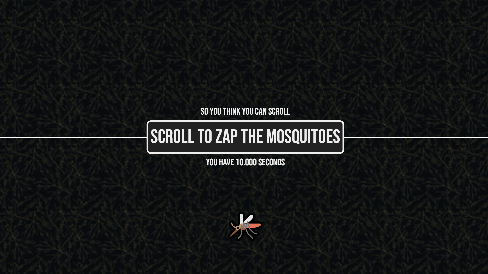

# So You Think You Can Scroll

## Introduction

[**Try the game here!**](https://engineerbo.github.io/so-you-think-you-can-scroll/)

This is a simple game for you to prove your scrolling abilities (and devices).

It inspired by the comments section in [this video](https://youtu.be/FSy9G6bNuKA) discussing various scrolling devices.

Gameplay is simple:

- Scroll up or down to "zap" the mosquitoes by touching them with the horizontal line (a.k.a. the _zapper_)
- The timer starts when you zap the first mosquito
- The game ends when the time runs out

You may use any means of scrolling, e.g. scroll wheel, middle-click scrolling, trackpad, or even a [high resolution scrolling dial](https://youtu.be/FSy9G6bNuKA).

> [!TIP]
> You might need to lower the "lines per notch" setting of your scroll wheel

## Contributing

This game was whipped up overnight, and can undoubtedly be improved tremendously, particularly in terms of scoring fairness (i.e. better performance should result in better scores).

If you'd like to help with improving this, feel free to send me a pull request!
